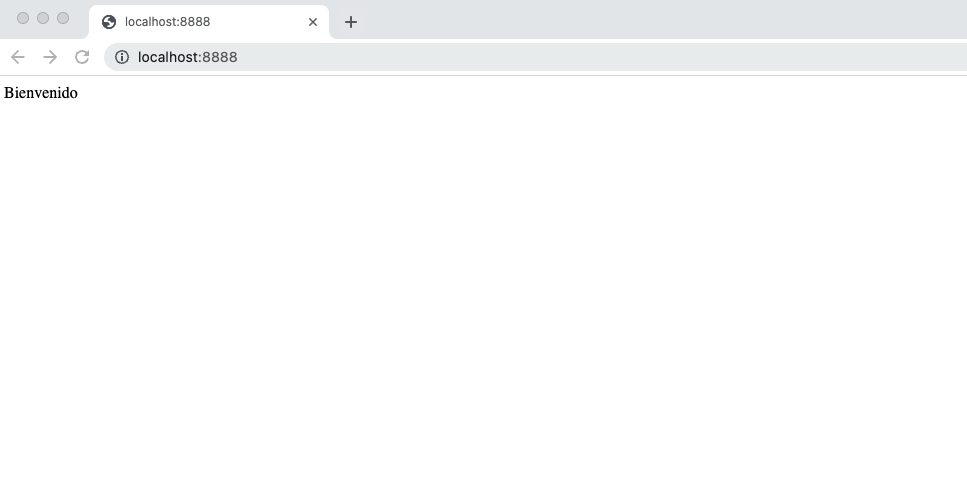

# DESAFIO FINAL MODELO 1

## Preparación

* Cuenta de [Docker Hub](https://hub.docker.com/)
* Cuenta de [AWS](http://aws.amazon.com/) **Opcional
* Cuenta de [Heroku](https://dashboard.heroku.com/login) 
* Haz un fork de este repositorio

## Práctica 1

Dado este proyecto en NodeJS, crea su Dockerfile sabiendo que nos han pedido como imagen base ubuntu:18.04, versión 16 de NodeJS, el 8888 será el puerto donde exponga la comunicación la applicación, la señal de *STOP* debe llegarle a la aplicación y el contenedor podría ser iniciado con cualquier proceso.

## Práctica 2

Sube la imagen de Docker a DockerHub.

## Práctica 3

Automatiza el proceso de creación de la imagen de Docker y su subida a Docker Hub después de cada cambio en el repositorio utitlizando Github Actions.

## Práctica 4

Crea un servidor y despliega la imagen de Docker en AWS utilizando Terraform.

Si no se cuenta con cuenta en AWS, se debe crear una aplicación en Heroku y desplegarla allí usando github actions.

### Resultado:

